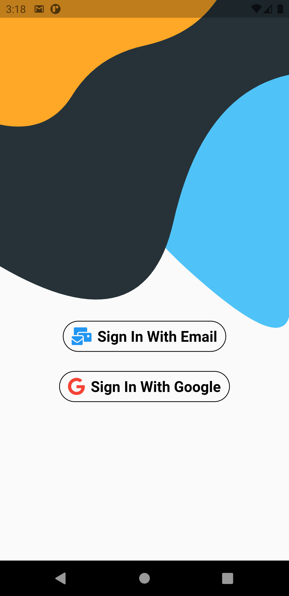
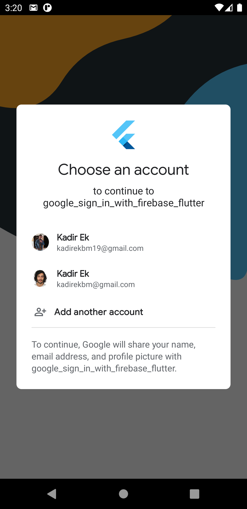
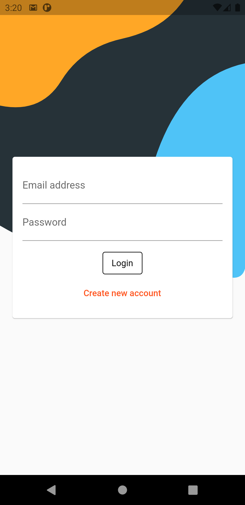
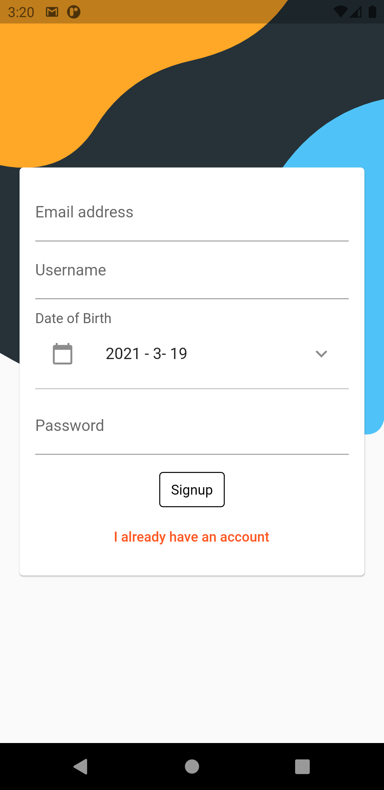
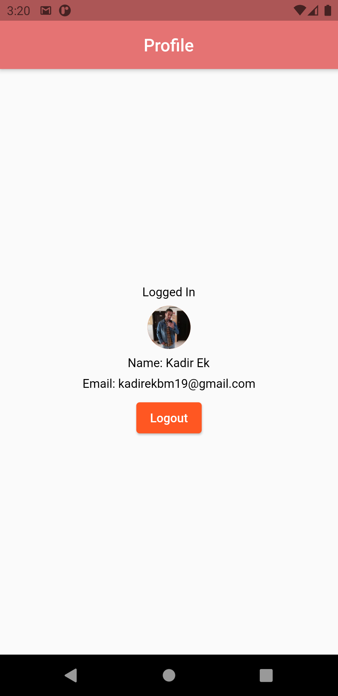

# google_sign_in_with_firebase_flutter

Email and Google Sign in

## Screenshots

This project is a starting point for a Flutter application.

 
 <kbd>
  
</kbd>
  <kbd>
  
</kbd>
  <kbd>
  
</kbd>
  <kbd>
 
</kbd>
  <kbd>
  
</kbd> 

